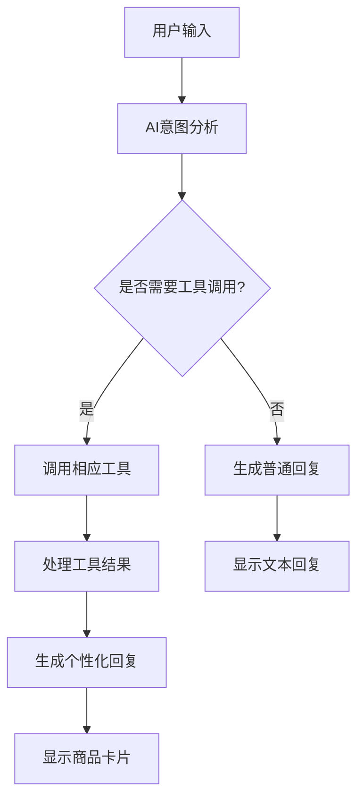

# MCP集成使用指南

## 概述

MCP (Model Context Protocol) 集成让AI能够主动调用工具来搜索商品和处理用户请求，而不仅仅是被动分析文本。

## 功能特性

### 🛠️ 可用工具

1. **search_products** - 商品搜索
   - 当用户表达购买意图时自动触发
   - 支持关键词、类别、结果数量设置
   - 返回真实的商品搜索结果

2. **get_product_details** - 商品详情
   - 获取特定商品的详细信息
   - 支持通过商品ID查询

3. **compare_products** - 商品比较
   - 比较多个商品的特性
   - 支持价格、功能、评分、卖家等维度

### 🤖 AI工作流程



## 使用示例

### 商品搜索对话

**用户：** "我想买个手机"

**AI处理过程：**
1. 识别购买意图
2. 调用 `search_products("手机", "digital_goods")`
3. 获取真实搜索结果
4. 生成个性化推荐回复
5. 展示商品卡片

**AI回复：**
```
为您找到了 156 件相关商品！以下是为您精选的推荐：

1. **iPhone 15 Pro** - ¥7,999
2. **小米14 Ultra** - ¥5,499  
3. **华为Mate60 Pro** - ¥6,999

您可以点击商品卡片查看详细信息，或者告诉我您的具体需求，我可以为您提供更精准的推荐！
```

### 商品比较对话

**用户：** "这几款手机哪个好？"

**AI处理过程：**
1. 识别比较需求
2. 提取前面提到的商品ID
3. 调用 `compare_products([id1, id2, id3], ["price", "features"])`
4. 分析比较结果
5. 生成对比分析

## 技术实现

### 1. 工具定义 (`mcp-tools.js`)

```javascript
export const MCP_TOOLS = {
  search_products: {
    name: 'search_products',
    description: '搜索商品。当用户表达购买意图时使用。',
    parameters: {
      type: 'object',
      properties: {
        query: { type: 'string' },
        category: { type: 'string', enum: ['all', 'digital_goods', ...] },
        max_results: { type: 'number', minimum: 1, maximum: 20 }
      }
    }
  }
}
```

### 2. AI服务集成 (`ai-services.js`)

```javascript
class GeminiAIService extends AIServiceBase {
  async chat(messages, options = {}) {
    const requestBody = {
      contents: this.formatMessagesForGemini(messages),
      tools: [{ function_declarations: this.getGeminiFunctionDeclarations() }]
    }
    
    // 处理函数调用响应
    if (candidate?.content?.parts?.[0]?.functionCall) {
      return await this.handleFunctionCall(functionCall, usage)
    }
  }
}
```

### 3. 聊天Store集成 (`ai-chat.js`)

```javascript
const sendMessage = async (content) => {
  const intentAnalysis = await aiServiceManager.value.analyzeIntent(content)
  
  if (intentAnalysis.toolResult) {
    // AI已通过工具调用完成搜索
    response = await handleMCPToolResult(content, intentAnalysis)
  } else {
    // 普通对话或备用逻辑
    response = await handleGeneralConversation(content, intentAnalysis)
  }
}
```

## 配置要求

### 环境变量

```bash
# Gemini API (推荐)
VITE_GOOGLE_AI_API_KEY=your_gemini_api_key

# 或 OpenAI API
VITE_OPENAI_API_KEY=your_openai_api_key

# 或 Claude API  
VITE_CLAUDE_API_KEY=your_claude_api_key
```

### AI设置界面

用户可以通过SmartHome页面的"AI设置"按钮：
- 选择AI服务提供商
- 输入API密钥
- 测试连接状态
- 调整模型参数

## 优势对比

### 传统方式 vs MCP集成

| 传统文本分析 | MCP工具调用 |
|-------------|------------|
| 基于关键词匹配 | AI主动判断工具需求 |
| 固定搜索逻辑 | 智能参数生成 |
| 静态回复模板 | 动态个性化回复 |
| 可能遗漏意图 | 更准确的意图识别 |

### 主要优势

1. **智能化程度更高** - AI主动判断何时需要搜索
2. **个性化回复** - 基于真实搜索结果生成回复
3. **准确性提升** - 减少误判和遗漏
4. **扩展性强** - 易于添加新工具
5. **用户体验好** - 更自然的对话流程

## 故障排除

### 常见问题

1. **工具调用失败**
   - 检查API密钥配置
   - 确认网络连接
   - 查看控制台错误日志

2. **搜索结果为空**
   - 验证搜索API可用性
   - 检查搜索参数格式
   - 查看后端服务状态

3. **AI不调用工具**
   - 确认enableTools参数为true
   - 检查提示词是否包含工具定义
   - 尝试更明确的用户输入

### 调试技巧

```javascript
// 开启详细日志
console.log('AI意图分析:', intentAnalysis)
console.log('工具调用结果:', toolResult)

// 检查工具定义
const tools = mcpToolExecutor.getToolDefinitions()
console.log('可用工具:', tools)
```

## 未来扩展

### 计划功能

1. **价格监控工具** - 监控商品价格变化
2. **库存提醒工具** - 商品库存状态通知
3. **个性化推荐工具** - 基于用户历史的推荐
4. **订单查询工具** - 查询订单状态
5. **评价分析工具** - 分析商品评价情感

### 集成建议

- 保持工具接口简单清晰
- 提供详细的错误处理
- 记录使用统计和性能指标
- 定期更新工具定义和文档

---

*最后更新：2024年12月* 